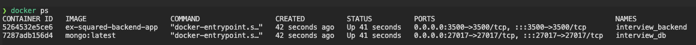

# Interview Backend

## Table of content
- [Technologies](#technologies)
- [About](#about)
- [Running the Project](#running-the-project)
  - [Using Docker](#using-docker)
  - [On your machine](#on-your-machine)
- [Author](#author)

## Technologies


## About

This project corresponds to the EX Squared Back End challenge. It exposes a single graphql service that transform and store data from XML to JSON.

## Before Running the Project
It's necessary to create a new `.env` and `.env.test.local` files in the root project to define all necessary environment variables, there is a `.env.example` file with a variable list. Anyway, you can learn more about them here.

| Key | Description |
|-----|-------------|
| `PORT` | Port to expose the API |
| `DB_HOST` | MongoDB host |
| `DB_PORT` | MongoDB port |
| `DB_DATABASE` | MongoDB database name |
| `DB_USERNAME` | MongoDB access username |
| `DB_PASSWORD` | MongoDB access password |

## Running the Project
### Using Docker
I truly recommend you use docker and avoid any conflicts with other dependencies, libraries, and projects. In the same way, you will be able to start the project and database with just one command.
#### Prerequisite
- Have any experience using docker as a development tool. Here is the [docs](https://docs.docker.com/get-started/02_our_app/) 
- Install [Docker](https://docs.docker.com/get-docker/) by your OS.

#### Build the Project
Before running the project, it's necessary to build the docker image for the app and database on your machine. So, you need to run the command above in your terminal located on the root project directory.
```bask
$ docker-compose build
```

#### Run The Project
Now we can run the project and database. Once you build the image you can run the above command to initialize all your environment.
```bash
$ docker-compose run -d
```
When you execute this, in general, docker will do two things:
1. Initialize and expose the MongoDB container on port 27017. You can see all configurations and make any changes on the `docker-compose.yml` file.
2. Once MongoDB is already up, the app container will begin to set up on port 3500. Automatically the command `npm run start:dev` will be executed, which means that when you make a change in the project the docker container will be updated automatically. You can see how is this working on `docker-compose.yml`.

If you want to confirm that everything is running good, you can execute the command above and see the containers list:
```bash
$ docker ps
```




### On your machine
If you prefer running the API locally, ensure you meet all these prerequisites:
#### Prerequisite
- Install NodeJS to execute javascript without any browser. You can install it [here](https://nodejs.org/en/download/).
- Install and set up MongoDB Community Server for the database. You can install it [here](https://www.mongodb.com/try/download/community).

#### Installation
Once you have NodeJS and MongoDB in your machine, run the command above in your terminal located on the root project:
```bash
$ npm install
```

#### Run the Project
```bash
# development
$ npm run start

# watch mode
$ npm run start:dev

# production mode
$ npm run start:prod
```


### Author
- Author: Rafael Vilomar
- LinkedIn: https://www.linkedin.com/in/rafavilomar/
- Email: rafavilomar@gmail.com
